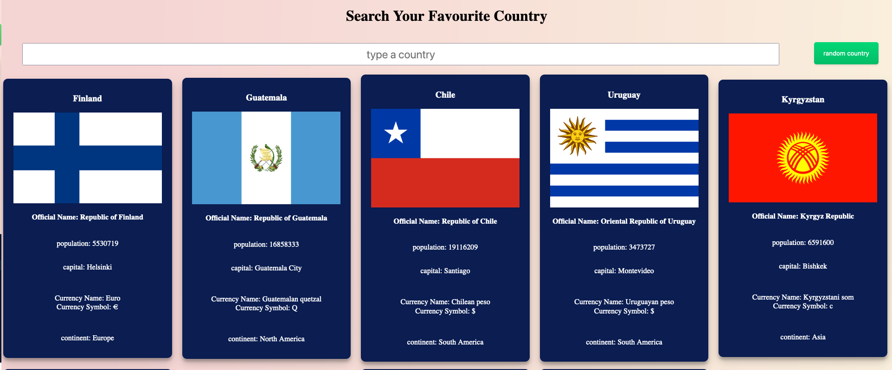
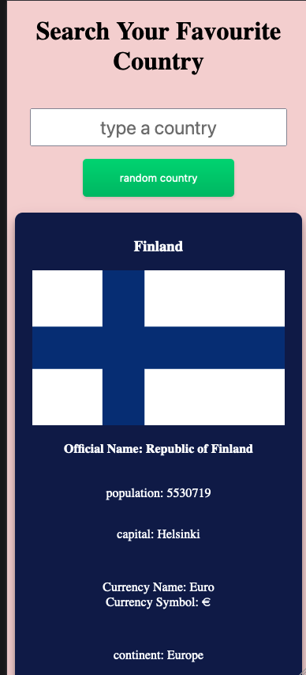

# Country Fact Search tool

This is a simple Search tool that displays some basic facts about all the countries of the world. 

## Table of contents

- [Overview](#overview)
  - [What I found challenging](#What-I-found-challenging)
  - [Screenshot](#screenshot)
  - [Link](#link)
- [My process](#my-process)
  - [Built with](#built-with)
    -[what I learned](#what-I-learned)
    - [Continued development](#continued-development)


## Overview
I had recently watched some videos on using the fetch API and I wanted to challenge myself to create a simple page that relayed facts about different countries using an API. 
The current version of this project is based of a tutorial from [WebDev Simplified](https://www.youtube.com/watch?v=TlP5WIxVirU), though I have largely rewritten it to use template literals. 


###What I found challenging.

The API returned a lot of data, as various properties of objects for each country. Though some country objects had all the properties. This caused a TypeError at first meaning only 180 of 250 countries rendered. Overcoming this was challenging. 

In addition, the original way the tutorial used HTML templates and the data attribute to render the data. This was new for me, but due to the amount of data I wanted display, it meant my original code was very repetitive. Thus I decided to refactor it to use template literals. This meant rewriting the code completely and getting it to work again. 


### Screenshot




### Link
 [Live site](https://zach7815.github.io/country-Fact-search-bar/)

## My process
This project was originally based off a tutorial based by webdev simplified. However, I have modified it to use a different API. The API data is more complex that the tutorial and is harder to access and display. This project therefore
builds on the tutorial and uses the core concepts on how to make api calls using fetch. Initially, to build this project I followed the tutorial but quickly adapted it to meet my needs. I am currently working on refactoring it and changing 
how it pulls data from the API. This is because the current version of the project is too verbose and not in good keeping with DRY principles.  Therefore, I am looking to adapt the current code to take advantage of 
Destructing and Template literals that should allow me to write cleaner and easier to maintain code. 


### Built with

- HTML 5
- Grid
- Flexbox
- Fetch API

### What I learned
- I learnt quite a few things with this project. This was my first time really using the Fetch API and handling promises for Asynchronous code, so I have learnt how to handle data being requested from it. 

- Additionally, it is the largest and most complex dataset I have worked with so far. Working out how to access all the data like Currency was a difficult challenge as some countries (Antartica) didn't have that property. This caused errors which I needed to handle to stop the fetch API from crashing. 

- In addition, I learnt how to hide all country cards that didn't match the search query. While I stuck with the original way of doing it in the tutorial, I had to adapt the code to ensure each country in the places array had a class element to toggle. 

For CSS:

I continued practicing CSS Grid and relearned minMax CSS function. This allowed me dynamically render the same number of country cards to each row. 

```css
 .container{
        display:grid;
        grid-template-columns:  repeat(auto-fill, minmax(368px, 1fr));
        grid-template-rows: auto;
    }
```

JS: 
 At first my search bar would only render 180 countries. This is because the 181 country lacked a currency and thus stopped the loop. It also turned out that some countries didn't have capitals. The problem was the currency was an object of a property with one or more objects. This meant I needed to use object,keys(currency) to access it. Though when there wasn't a key I got a TypeError.  Thus I used the code below to overcome this problem.

```js
 if(country.currencies){
                currencyKey=Object.keys(country.currencies)
                currencyKey.map(key=>{
                   currency=   country.currencies[key].name;
                   currencySymbol=country.currencies[key].symbol;
                       })
            }
            else{
                currencyKey="no currency"
            }
```

### Continued development

My next steps is to finish a weather APP dashboard that uses React for the frontend. I plan to incoporate the fetch api with the project and thus used this project as a smaller scale test and learn way to render elements from an API call. 